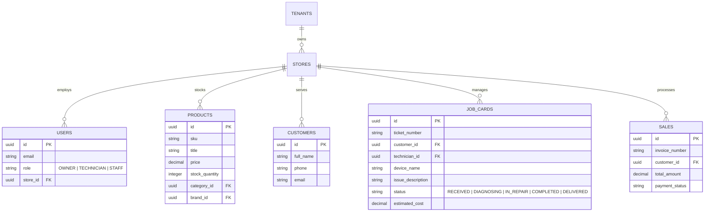

# Entity Relationship Diagram (ERD) Blueprint

High-level domain model outline for **Fahad ERP**:

```mermaid
erDiagram
    TENANTS ||--o{ STORES : owns
    STORES ||--o{ USERS : employs
    STORES ||--o{ PRODUCTS : stocks
    STORES ||--o{ CUSTOMERS : serves
    STORES ||--o{ JOB_CARDS : manages
    STORES ||--o{ SALES : processes

    USERS {
        uuid id PK
        string email
        string role "OWNER | TECHNICIAN | STAFF"
        uuid store_id FK
    }

    CUSTOMERS {
        uuid id PK
        string full_name
        string phone
        string email
    }

    PRODUCTS {
        uuid id PK
        string sku
        string title
        decimal price
        integer stock_quantity
        uuid category_id FK
        uuid brand_id FK
    }

    JOB_CARDS {
        uuid id PK
        string ticket_number
        uuid customer_id FK
        uuid technician_id FK
        string device_name
        string issue_description
        string status "RECEIVED | DIAGNOSING | IN_REPAIR | COMPLETED | DELIVERED"
        decimal estimated_cost
    }

    SALES {
        uuid id PK
        string invoice_number
        uuid customer_id FK
        decimal total_amount
        string payment_status
    }
```
